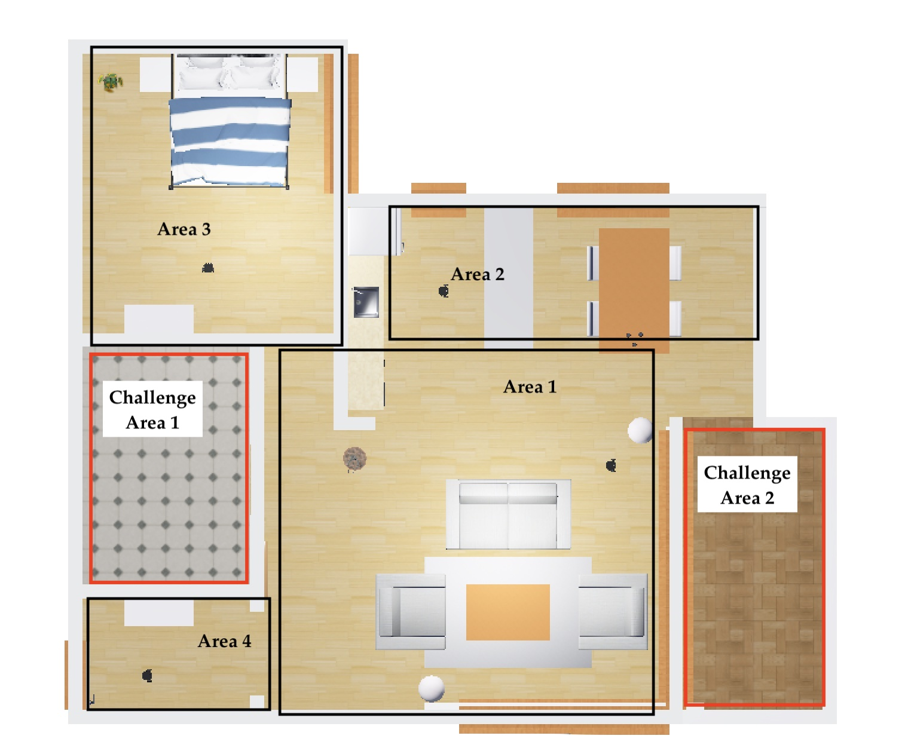
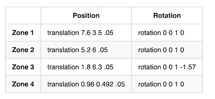
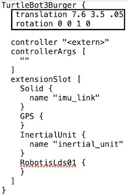

**Fall 2023 - Homework #1 CS460/560**

***Heuristic Search***

You have been given a simulated apartment and you need to "cover" the environment to determine if it is occupied. You will search with a turtlebot equipped with a 360 \degree lidar. Create a robot controller (via ROS2) that explores (enters) each of four apartment zones (see Figure 1) from one of four starting locations. The controller will not know the starting position so the code that you will create must be able to avoid obstacles as they are encountered and recover from stalls, if possible.

_Figure 1 Divides apartment into four search zones, each with the robot starting position denoted in Table 1_

***Logistics:***

1. You should start with the example ROS2 package webots\_ros2\_homework1\_python in the class ([github repository](https://github.com/monicadelaine/f23_robotics/tree/main)) . It is suggested you should fork this repository and clone it to your Ubuntu/ROS2 instance. Keep in mind other homework assignments will have needed files available in this repository.
2. Simulated environment, simulated robot and starting locations are specified as text in the ../webots\_ros2\_homework1\_py/worlds/f23\_robotics\_1.wbt world file. This file can be updated by a text editor.
3. Use ([webots\_ros2\_homework1\_py](../webots_ros2_homework1_python/webots_ros2_homework1_python/webots_ros2_homework1_python.py)) as a starting point for your controller. You can use code online as an example, but you must cite any code you use. Your code cannot have any position specific code. However, you can create/persist local measurements or local timers within a trial.
4. You will code and test your controller from specified starting points in each zone (see Table 1). To change the starting position, you should edit the world file and replace the translation and rotation specifications with the values in the table (Example of world file section to update in Figure 2).
5. Your final controller should be tested using five trials from each position (for a total of 20 trials). A log of the robot positions in the robot frame for each trial should be created.

_Table 1 Position information for each zone. Replace the translation and rotation lines for each zone_

***Hand in a pdf report that includes:***

- A table that lists the total path length and the most distant point in each zone for each trial
- A figure that plots the robot path for the five trials from each starting position superimposed over the ([image of the apartment](./apartment.png)).
- Explanation of approach in controller that cites any code used as an example
- Discussion of implementation that include advantages and disadvantages and rationale for approach

**\*\* Any file updates will be committed to the repository. "Watch" the repository for notifications from github**

_Figure 2 Update translation and rotation to specified starting points in each zone_
